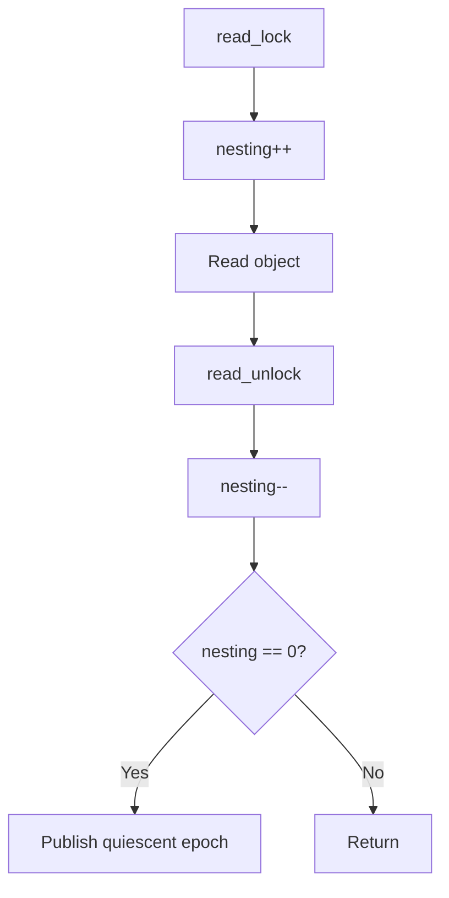
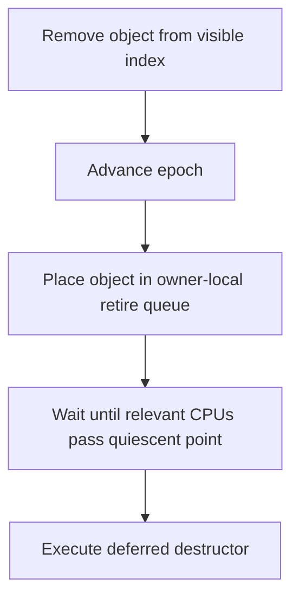

# KDS-RCU-002: Epoch RCU-lite

## Context
Bharat-OS currently has `bh_rcu_stub` where operations are no-ops. To support read-mostly lockless lookups (capabilities, metadata, registries), a real non-preemptible epoch/QSBR RCU-lite implementation is needed.

## Design
A simplified RCU-lite using an epoch-based quiescent state model.

### Data Structures

```c
struct bh_rcu_state {
    atomic_u64 global_epoch;
};

struct bh_rcu_cpu_state {
    uint32_t nesting;
    uint64_t observed_epoch;
    uint64_t quiescent_epoch;
    struct bh_rcu_retire_queue retire_queue;
};

struct bh_rcu_head {
    void (*callback)(struct bh_rcu_head *head);
    uint64_t retirement_epoch;
    struct bh_rcu_head *next;
};
```

### Hardware Acceleration
* **ARM:** LSE atomics, fallback to LL/SC.
* **RISC-V:** Zacas, fallback to LR/SC.
* **x86:** CMPXCHG/locked instructions.

## Architecture Models

### Read Path



### Write/Reclamation Path



## Execution Plan
1. **State Implementation**: Implement global `bh_rcu_state` and per-CPU `bh_rcu_cpu_state`.
2. **Read/Write Paths**: Implement reader enter/exit without global lock contention and writer object retirement.
3. **Grace Period Logic**: Implement wait mechanism tracking per-CPU quiescent states.
4. **Hardware Dispatch**: Wire atomic operations to hardware-accelerated variants (LSE, Zacas) via `hal_hw_caps_t`.
5. **Migration**: Migrate capability revocation metadata, IRQ-domain read-side lookup, and immutable registry lookup as initial consumers.
6. **Testing**: Write delayed reader tests, callback batching, and concurrent revoke/lookup scenarios.