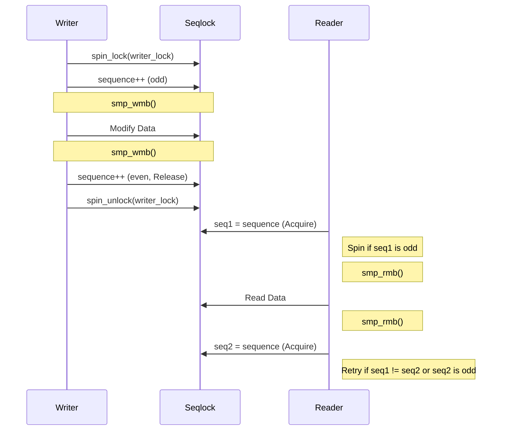

# KDS-SEQLK-002: Production Seqlock

## Context
The previous seqlock implementation modified and read the sequence using ordinary loads and increments. It lacked acquire/release semantics and memory barriers, making it unsafe for cross-CPU synchronization. This document describes the production-grade seqlock design.

## Design
Introduce a production-grade seqlock with explicit canonical memory ordering, atomic acquire/release semantics, and writer serialization.

### Reader and Writer Constraints
To safely use the `bh_seqlock`, callers must guarantee the following execution constraints:

* **Lockless Readers:** Readers never sleep or block. They are wait-free except when a writer is actively mutating the data structure, in which case they spin or retry.
* **IRQ Reader Constraints:** A reader executing from an IRQ context is **ONLY safe** when the corresponding writer execution completely prevents that IRQ from interrupting an active writer. If a writer is interrupted by an IRQ that attempts to read the same seqlock, it results in a deadlock.
* **Serialized Writers:** Only one writer can be active at a time. The seqlock provides internal serialization using a `spinlock_t`.
* **No Writer Nesting:** Writers may not nest (recursive attempts to write to the same seqlock will assert or deadlock).
* **No Sleep While Writing:** Writers must not sleep, block, or yield while holding the lock.
* **Caller Context Responsibility:** The base `bh_seqlock` does **NOT** alter preemption or IRQ state automatically. Callers are responsible for masking IRQs or disabling preemption depending on their specific execution contexts.

### 32-Bit Sequence Counter
The sequence counter is deliberately chosen to be a 32-bit atomic unsigned integer (`atomic32_t`) rather than a 64-bit integer.

#### Rationale for 32-bit:
On 32-bit architectures (like ARM32 and RISC-V32), 64-bit atomic operations may fallback to utilizing a global spinlock. If the seqlock reader required 64-bit atomics, it would potentially acquire this global fallback lock on every read, destroying the fundamental lockless guarantee of the reader path and exposing the kernel to IRQ deadlock scenarios.

#### Sequence Wrap Handling:
Using a 32-bit counter means the sequence will eventually wrap. Wrap itself is not treated as an error. The correctness invariant relies on the assumption that a reader-side critical section must not remain active across $2^{31}$ or more complete writer generations.

### Target Semantics

#### Reader
```text
reader:
    seq = acquire_load(sequence)
    spin/wait if odd
    read_barrier()

    read snapshot

    read_barrier()
    current = acquire_load(sequence)
    retry if current changed or is odd
```

#### Writer
```text
writer:
    spin_lock(writer_lock)

    increment sequence (relaxed)
    write_barrier() // order odd sequence before mutations

    modify snapshot

    write_barrier() // order mutations before even sequence
    increment sequence (release)

    spin_unlock(writer_lock)
```

### Data Structure

```c
typedef struct {
    atomic32_t sequence;
    spinlock_t writer_lock;
} bh_seqlock_t;
```

### Consumer Candidates
* Scheduler load snapshots
* Global time conversion parameters
* Topology snapshots
* IRQ statistics
* Diagnostic counters

## Architecture

