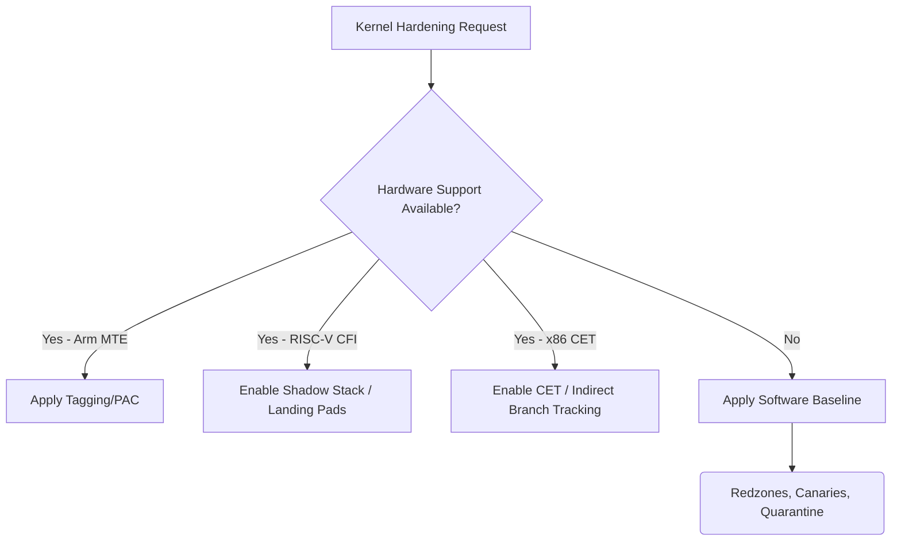

# KHARDEN-001: Hardware-Assisted Kernel Memory Safety

## Context
Bharat-OS can leverage advanced hardware features for kernel hardening. This should be an optional acceleration of a common hardening contract, not a separate kernel design.

## Design
Establish a unified kernel hardening contract with a software baseline and hardware-enhanced options based on capability discovery.

### Hardening Contract

#### Software Baseline
* Slab redzones
* Allocation generation
* Delayed reuse/quarantine
* Freelist corruption protection
* Stack canaries

#### Hardware-Enhanced (Dispatched via `hal_hw_caps_t`)
* Memory tagging
* Pointer authentication
* Branch target protection
* Shadow stack

### ISA Mapping
* **Arm**: MTE (Memory Tagging Extension), PAC/BTI (Pointer Authentication / Branch Target Identification).
* **RISC-V**: Zicfiss (shadow stack), Zicfilp (landing-pad CFI).
* **x86**: CET (Control-flow Enforcement Technology).

## Architecture Model

## Execution Plan
1. **Define Hardening API**: Create the neutral interface for applying memory and control-flow protection.
2. **Software Baseline**: Universally enable software redzones and quarantine mechanisms.
3. **Hardware Capability Hooks**: Tie the API to the new granular capabilities in `hal_hw_caps_t` (e.g., `memory_tagging`, `shadow_stack`).
4. **Architecture Backends**: Implement ISA-specific enablement for MTE, PAC/BTI, Zicfiss/Zicfilp, and CET.
5. **Testing**: Write security tests targeting UAF, buffer overflows, and ROP/JOP attempts to verify both software and hardware defenses.