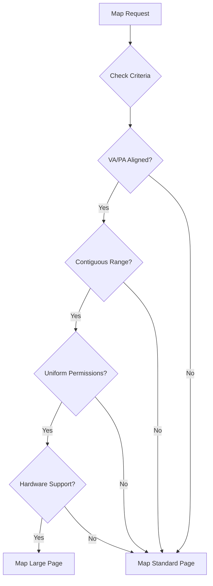

# KMM-HUGEPAGE-001: Huge-Page Promotion Mechanism

## Context
The existing x86 page-table backend supports 2 MiB mappings. This needs to be generalized into an explicit neutral kernel mechanism for large page promotion across architectures, reducing TLB pressure.

## Design
Attach metadata to VM regions to support hardware-assisted large mapping promotion/demotion.

### Region Metadata

```c
struct bh_vm_region_metadata {
    uint32_t allowed_page_sizes;
    uint32_t current_page_size;
    bool physical_contiguity;
    uint64_t alignment;
    bool protection_uniformity;
};
```

### Promotion Criteria
Mapping selects a larger page only when:
* VA alignment is correct
* PA alignment is correct
* Sufficient contiguous range exists
* Identical permissions apply across the range
* Hardware supports it (via `hal_hw_caps_t`)

## Architecture



## Execution Plan
1. **Generalize API**: Extract the x86 2 MiB logic into a neutral multi-granule mapping mechanism.
2. **Metadata Extension**: Add necessary constraints (alignment, contiguity, permissions) to VM region metadata.
3. **Promotion Logic**: Implement the criteria checking before committing to a page table update.
4. **Demotion Logic**: Implement safe splitting/demotion when parts of a large mapping require different permissions.
5. **Architecture Support**: Add ARM/RISC-V equivalents based on their page table structures.
6. **Policy Separation**: Ensure that the kernel only provides the mechanism; huge page preference policy remains outside.
7. **Testing**: Validate TLB pressure reduction and verify correctness during demotion (e.g., mprotect on a sub-region).