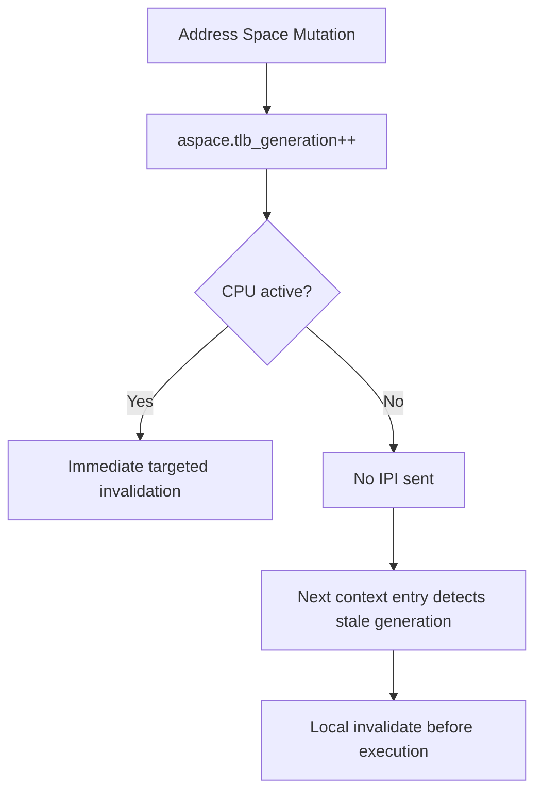

# KMM-TLBCTX-001: PCID/ASID-aware Lazy TLB Algorithm

## Context
The existing TLB interface declares lazy-generation capability, but it is incomplete. x86 enables PCID dynamically but lacks the higher-level lazy model. A full PCID/ASID-aware algorithm reduces cross-core disruption.

## Design
Build above the existing bounded TLB protocol to track generations and hardware context IDs, deferring invalidations for non-active CPUs.

### Data Structures

```c
struct bh_address_space {
    atomic_u64 tlb_generation;
    uint32_t hardware_context_id;
    uint64_t context_generation;
};

struct bh_cpu_tlb_state {
    struct bh_address_space *current_aspace;
    uint64_t last_seen_tlb_generation[MAX_HW_CONTEXTS];
};
```

### ISA Mapping
* **x86**: PCID, INVPCID/selective invalidation.
* **Arm**: ASID, TLBI.
* **RISC-V**: ASID, Svinval.

## Architecture



## Execution Plan
1. **Extend Structures**: Update `bh_address_space` with generation counters and context IDs. Add per-CPU `last_seen_tlb_generation`.
2. **Context ID Allocation**: Implement ID allocator for ASIDs/PCIDs.
3. **Lazy Invalidation Logic**: Modify the address-space mutation path to only IPI active CPUs and rely on lazy detection for others.
4. **Context Switch Integration**: Update context switch path to check generations and invalidate locally if stale.
5. **Hardware Dispatch**: Use ISA-specific features (PCID, ASID, Svinval) through the HAL capability layer.
6. **Testing**: Stress test concurrent address space mutations and context switches.