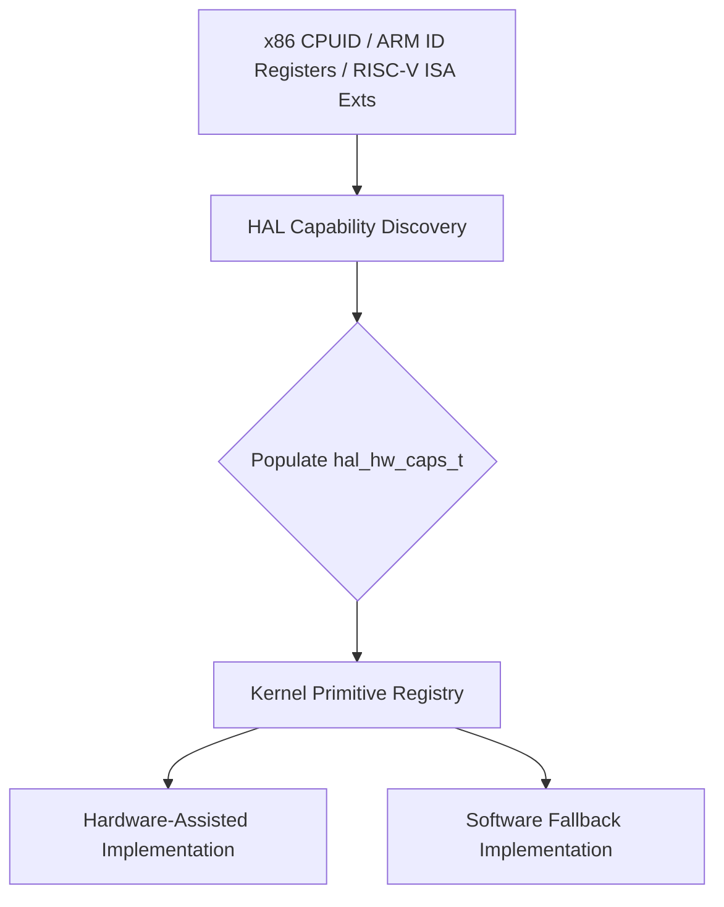

# KPRIM-002: Hardware-Adaptive Primitive Dispatch

## Context
The goal is to provide granular mechanism-level capabilities for hardware-adaptive primitives. The existing architecture supports coarse features (`has_atomic_64`, `has_mmu`), which is insufficient for dispatching optimal algorithmic variants.

## Design
Extend the existing capability structure (`hal_hw_caps_t`) and primitive registry with granular capabilities that remain architecture-neutral.

### Extended Capability Model (`hal_hw_caps_t`)

```c
typedef struct {
    // Existing broad capabilities...

    // New fine-grained capabilities:
    bool atomic_cas64;            // Native 64-bit CAS
    bool atomic_cas128;           // Native 128-bit CAS
    bool atomic_fetch_add;        // Native atomic RMW
    bool wait_on_memory;          // Efficient CPU wait until memory changes
    bool tlb_context_id;          // ASID/PCID-style context identifiers
    bool tlb_addr_context_flush;  // Address + context-specific invalidation
    bool tlb_range_flush;         // Hardware-efficient range invalidation
    bool timer_absolute_deadline; // Absolute per-core comparator
    bool cache_block_zero;        // Fast cache-line/block zero
    bool cache_clean;             // Explicit clean operation
    bool cache_invalidate;        // Explicit invalidate
    bool large_page_2m;           // Large mapping size
    bool large_page_1g;           // Larger mapping size
    bool memory_tagging;          // Memory tag enforcement
    bool pointer_auth;            // Authenticated control pointers
    bool branch_target_guard;     // Indirect branch target enforcement
    bool shadow_stack;            // Hardware shadow stack
} hal_hw_caps_t;
```

### Dispatch Architecture



## ISA Mapping
* **x86-64:** CMPXCHG16B, PCID, INVLPG, WAITPKG/MONITOR, CET
* **ARM64:** LSE atomics (CASP), ASID, TLBI, WFE, MTE, PAC/BTI
* **RISC-V64:** Zacas, Zawrs, ASID/Svinval, Sstc, Zicboz, Zicfiss/Zicfilp

## Execution Plan
1. **Extend `hal_hw_caps_t`**: Add the boolean flags for new neutral capabilities.
2. **Architecture Discovery**: Update `arch/x86`, `arch/arm`, and `arch/riscv` to translate CPU registers into these neutral features.
3. **Primitive Registry Update**: Adapt the registry for boot-time immutable dispatch based on these granular capabilities.
4. **Audit Rule Enforcement**: Implement the P0 audit rule checking for direct enablement of optional features without discovery.
5. **Testing**: Add feature-present and feature-absent tests for all three 64-bit architectures.