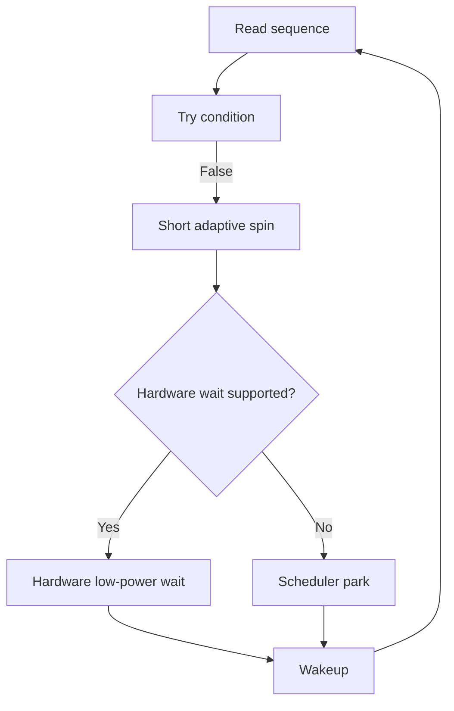

# KSYNC-EVENT-001: Eventcount Adaptive Wait

## Context
Need a primitive for transaction completion, IPC receive, and scheduler completion cells that adapts between spinning, low-power waiting, and parking.

## Design
The `bh_eventcount` acts as an adaptive wait primitive, complementing MPSC queues, utilizing hardware wait instructions when available.

### Data Structure

```c
struct bh_eventcount {
    atomic_u64 sequence;
    bh_waitq_t waiters;
};
```

### ISA Mapping
* **RISC-V**: Zawrs
* **Arm**: WFE / event mechanisms
* **x86**: WAITPKG / PAUSE

## Architecture Model



## Execution Plan
1. **Define `bh_eventcount`**: Implement structure with sequence and wait queue.
2. **Adaptive Spin**: Implement the initial short spin loop.
3. **Hardware Wait**: Dispatch to ISA-specific low-power wait instructions (Zawrs, WFE, WAITPKG) using the HAL capability layer.
4. **Scheduler Fallback**: Implement the final fallback to scheduler park.
5. **Producer Wake**: Implement sequence increment and waiter wake logic.
6. **Testing**: Verify contention behavior and power efficiency improvements.