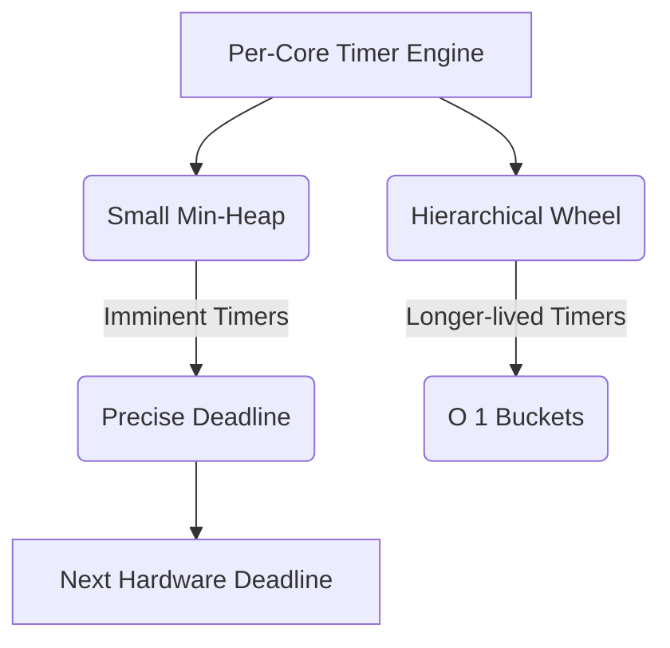

# KTIMER-001: Hybrid Timer Engine

## Context
Bharat-OS requires an efficient timer engine for distributed deadlines, EDF scheduling, and timeouts. A hybrid structure (min-heap + timing wheel) per core provides O(1)-like efficiency for long timers and precise resolution for imminent ones.

## Design
A per-core hybrid timer combining a small min-heap and a hierarchical timing wheel.

### Hardware Backend
The hardware comparator is programmed only for the earliest required deadline.
* **x86**: Architectural deadline timer.
* **Arm64**: Generic Timer comparator.
* **RISC-V**: Sstc `stimecmp`.

## Architecture Model

## Execution Plan
1. **Absolute Deadline Contract**: Extend the generic timer contract to support absolute deadlines.
2. **Hybrid Structure Implementation**: Build the min-heap and hierarchical wheel data structures.
3. **Timer Insertion/Removal**: Implement logic to route imminent timers to the heap and others to the wheel.
4. **Hardware Backend Dispatch**: Wire the engine to the earliest deadline using `hal_hw_caps_t` to select architectural timers.
5. **Tickless Idle**: Integrate with the scheduler to enable tickless idle behavior based on the next deadline.
6. **Testing**: Validate timer firing order, stress test insertion/removal, and test boundary conditions across the heap/wheel interface.