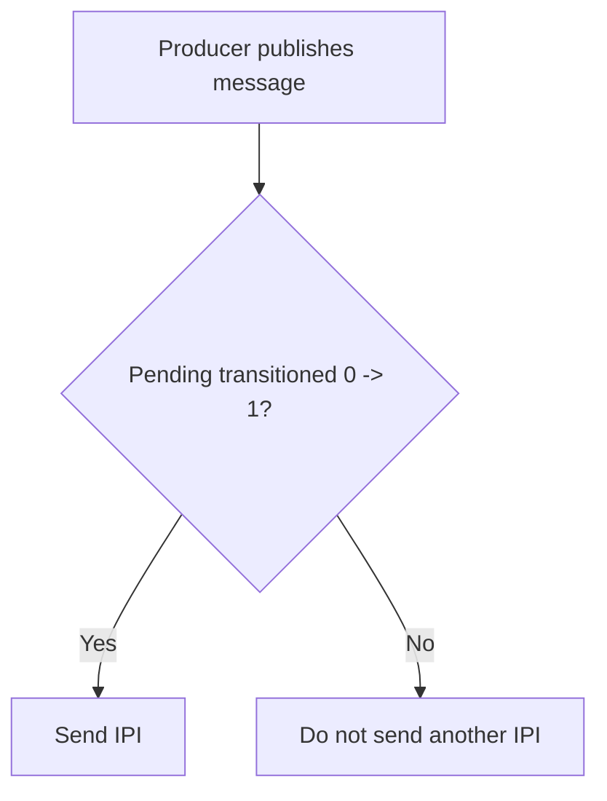

# KURPC-FAST-001: Per-peer SPSC Fast Lanes for uRPC

## Context
While MPSC handles generic many-to-one communication, stable peer-to-peer pairs benefit from uncontended SPSC rings, lowering cross-core communication cost while preserving the "no direct remote mutation" rule.

## Design
Introduce cacheline-separated SPSC channels with doorbell coalescing for stable peer pairs.

### Channel Structure

```text
CPU 0 ───── SPSC ─────> CPU 3
CPU 3 ───── SPSC ─────> CPU 0
```

### Properties
* No contended atomic producer head.
* Producer owns `head`, consumer owns `tail`.
* Release when publishing, acquire when consuming.
* Cache-line separation of producer/consumer metadata.

## Architecture: Doorbell Coalescing



## Execution Plan
1. **Define SPSC Ring**: Implement cache-aligned, separation of head and tail pointers.
2. **Memory Ordering**: Apply explicit acquire/release semantics to head/tail updates.
3. **Doorbell Coalescing**: Implement the `0 -> 1` pending transition check to minimize IPIs.
4. **Integration**: Allow setup of SPSC fast lanes alongside the generic MPSC fallback.
5. **Testing**: Benchmark IPI reduction and throughput increases for stable peer communication.