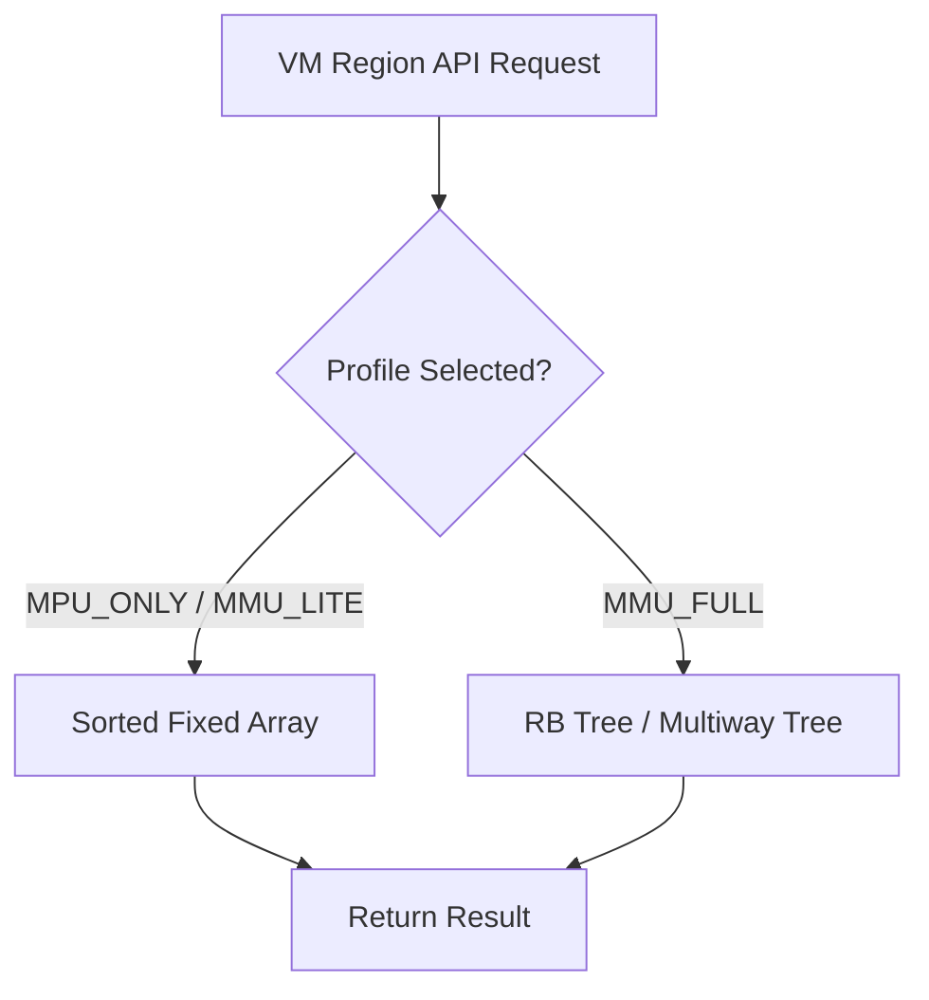

# KVM-RANGE-002: MMU_FULL VM Linear Range Index

## Context
The current `bh_range_tree` is a sorted fixed array. While suitable for MPU/MMU_LITE, linear search and shift operations do not scale for MMU_FULL profiles.

## Design
Introduce two implementations behind one unified API: a sorted fixed array for constrained profiles and an RB-tree (progressing to a multiway range tree) for scalable configurations.

### Profile Implementations
| Profile | Index Implementation |
|---|---|
| MPU_ONLY | Sorted fixed array |
| MMU_LITE | Sorted fixed array |
| MMU_FULL (small) | RB tree |
| MMU_FULL (scalable)| Cache-friendly multiway range tree |

### Future Multiway Node Concept

```c
struct bh_vm_range_node_internal {
    uint64_t pivots[N];
    struct bh_vm_range_node *children[N+1];
    uint32_t gap_metadata;
};

struct bh_vm_range_leaf {
    struct bh_vm_region regions[N]; // start, end, region ptr
};
```

## Architecture



## Execution Plan
1. **Abstract API**: Ensure the `bh_range_tree` API cleanly hides the underlying implementation.
2. **Preserve Fallback**: Maintain the sorted fixed array implementation for MPU_ONLY/MMU_LITE.
3. **Implement RB Tree**: Add the RB-tree backend for MMU_FULL configurations.
4. **Node Allocation**: Ensure tree nodes are allocated from a bounded slab reserve, avoiding arbitrary `kalloc` in fault paths.
5. **RCU Integration**: Prepare the tree structure for owner-local writers and RCU read sides.
6. **Testing**: Profile performance improvements for MMU_FULL and verify correctness against the fixed-array baseline.