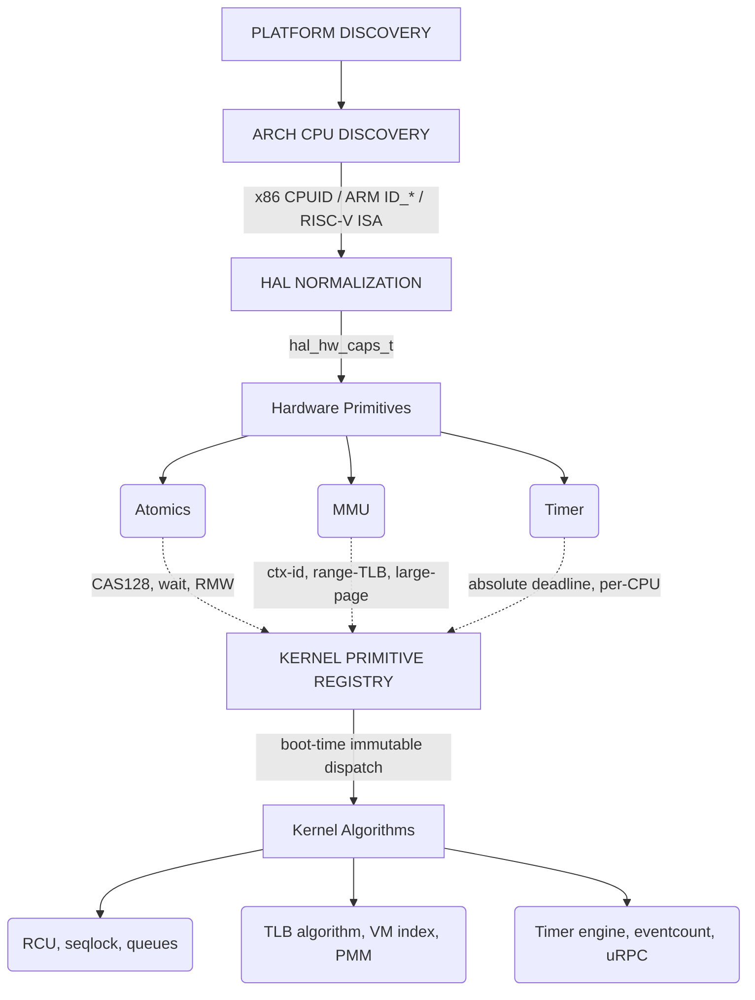

# Hardware-Adaptive Kernel Algorithms

This directory contains the design documentation, architecture details, and execution plans for the next phase of Bharat-OS kernel evolution: **Hardware-Adaptive Kernel Algorithms**.

## 1. Vision and Goal

The goal is to provide one portable kernel algorithm, a safe software baseline, and optional hardware-assisted implementations selected from truthful boot-time capabilities. This fits the Bharat-OS architecture rule:
* **Kernel** owns mechanism.
* **`arch/`** owns ISA implementation.
* **HAL** owns neutral contracts.
* **Platform** owns discovery.
* **Services** own policy.

The result is a distinctive model: the same kernel algorithms run from small ARM/RISC-V controllers through desktop/server-class SMP, with deterministic software fallbacks on minimal hardware and transparent acceleration on richer CPUs—without violating the multikernel ownership model or contaminating the kernel with hardware policy.

## 2. P0 Audit Rule

> **No optional CPU feature may be enabled or executed unless the architecture capability layer has positively discovered it, except features that the supported architecture baseline formally guarantees.**

## 3. Recommended Architecture Model

## 4. Execution Plan & Documentation Index

The following tasks comprise the detailed design for this phase:

### Core Capabilities
1. [**KPRIM-002** — Hardware-Adaptive Primitive Dispatch](KPRIM-002-primitive-dispatch.md)

### Concurrency & Synchronization
2. [**KDS-SEQLK-002** — Production Seqlock](KDS-SEQLK-002-production-seqlock.md)
3. [**KDS-RCU-002** — Epoch RCU-lite](KDS-RCU-002-epoch-rcu-lite.md)
4. [**KSYNC-EVENT-001** — Eventcount Adaptive Wait](KSYNC-EVENT-001-eventcount.md)
5. [**KURPC-FAST-001** — Per-peer SPSC fast lanes for uRPC](KURPC-FAST-001-spsc-lanes.md)

### Memory & TLB
6. [**KMM-TLBCTX-001** — PCID/ASID-aware Lazy TLB Algorithm](KMM-TLBCTX-001-lazy-tlb.md)
7. [**KVM-RANGE-002** — MMU_FULL VM Linear Range Index](KVM-RANGE-002-mmu-full-index.md)
8. [**KMEM-ACCEL-001** — Hardware-Assisted Secure Zero/Copy/Cache Operations](KMEM-ACCEL-001-hw-memops.md)
9. [**KMM-HUGEPAGE-001** — Huge-Page Promotion Mechanism](KMM-HUGEPAGE-001-multi-granule-mapping.md)
10. [**KHARDEN-001** — Hardware-Assisted Kernel Memory Safety](KHARDEN-001-hardware-assisted-safety.md)

### Timing
11. [**KTIMER-001** — Hybrid Timer Engine](KTIMER-001-deadline-engine.md)

## 5. Required Verification Evidence

For every new concurrent primitive, the following evidence must be provided:
* **Functional:** Expected lookup/enqueue/reclamation results.
* **Adversarial concurrency:** 2/4/8-core races, delayed cores, lost notifications.
* **Memory ordering:** Publish-before-visible, no torn snapshots, no premature reclamation.
* **Hardware fallback equivalence:** Hardware and software paths produce identical semantics.
* **Fault injection:** Stalled core, queue full, timer late, invalid feature report.
* **Cross-architecture:** x86_64 + ARM64 + RISC-V64.
* **Constrained profile:** ARM32/RV32 compile and explicit fallback/unsupported truth.
* **Performance:** Cycles/op, cache misses, IPIs, TLB flushes, wakeups.
* **Security:** Stale handle, UAF, tag failure, invalid TLB generation tests.
