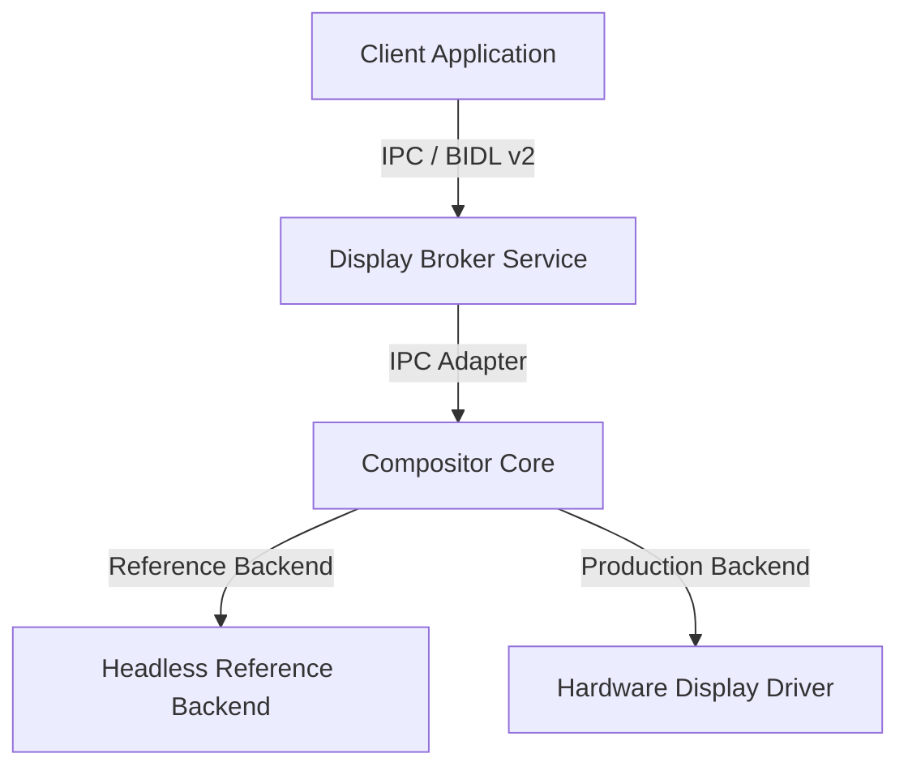
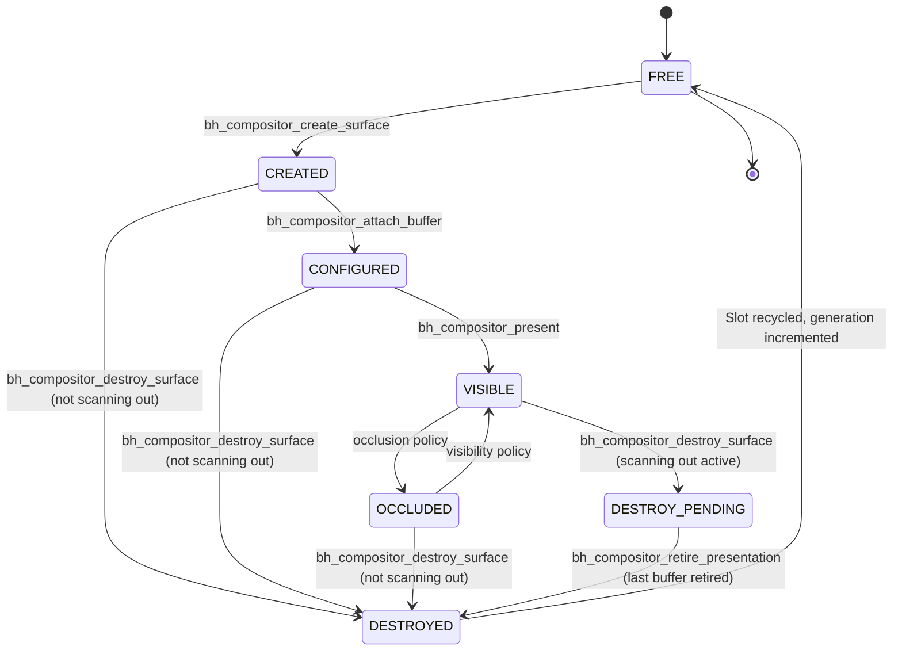
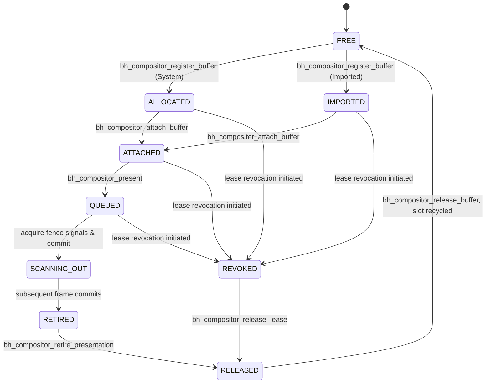
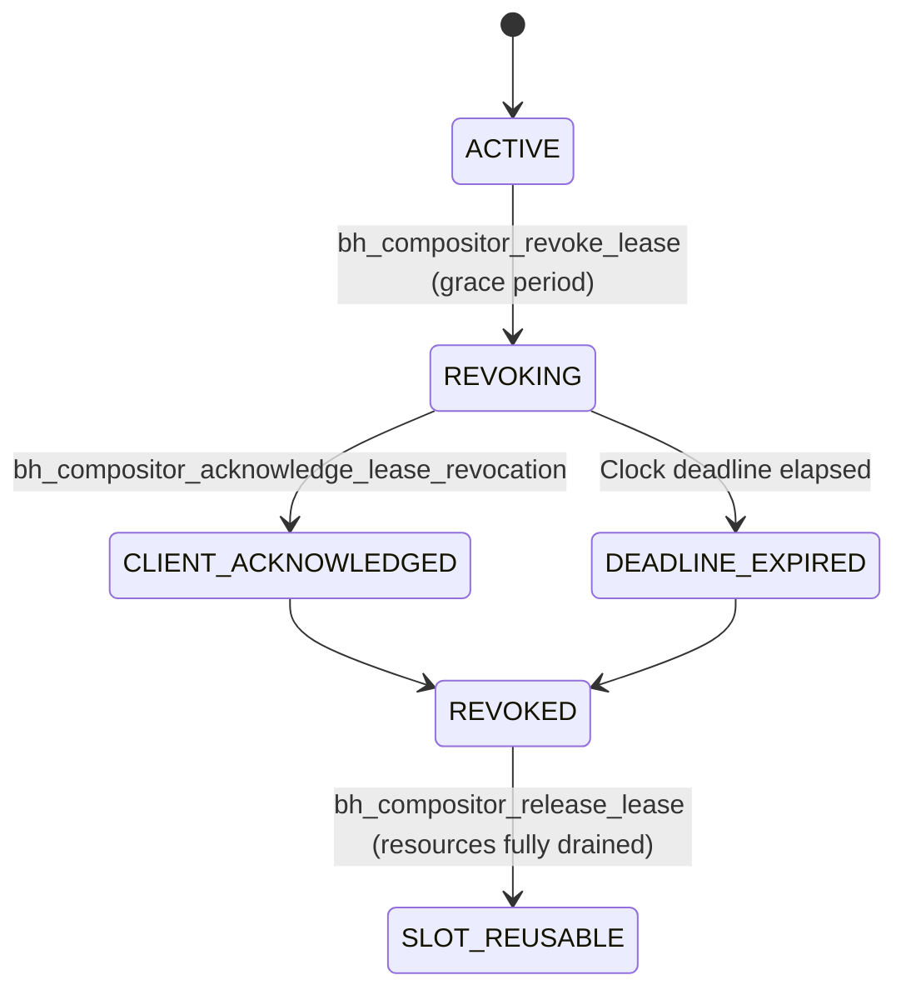
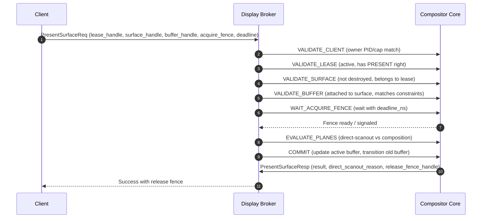
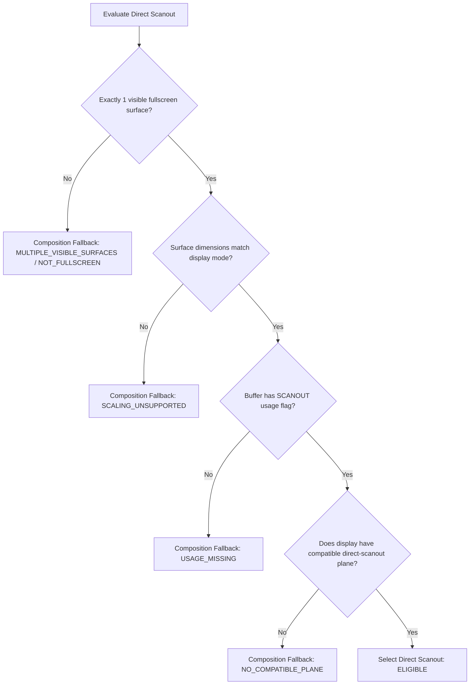

# Surface and Display-Buffer Lifecycle with Direct-Scanout Architecture

This document describes the baseline architectural model for capability-safe, multi-buffered, composition-optional user interfaces in Bharat-OS. The subsystem isolates core graphics policies outside of the kernel while strictly enforcing lifecycle and ownership invariants over displays, leases, surfaces, buffers, and fences.

## 1. Component Diagram

The following diagram illustrates the relationship between the client application, the display broker service, the transport-neutral core compositor, and display drivers.

---

## 2. State Machines

### A. Surface State-Machine Diagram

Surfaces follow a bounded lifecycle where destruction must wait for scanning buffers to retire.

### B. Buffer State-Machine Diagram

Buffers are trackable resource handles that cannot be released while queued or active on display planes.

### C. Lease-Revocation State Machine

Display leases offer exclusive control of output displays. Revocation allows the previous client a short grace period to acknowledge before resource recycling is forced.

---

## 3. Present Transaction Sequence Diagram

Every presentation undergoes an atomic transactional verification sequence:

---

## 4. Direct-Scanout Decision Flow

Direct-scanout selection is deterministic and avoids any hash-iteration or pointer ordering.

---

## 5. Capability and Ownership Model

- **Opaque 64-bit Handles**: Every display, lease, surface, buffer, and fence is referenced by a 64-bit handle:
  - Bits 0..15: Encoded Slot (Index + 1)
  - Bits 16..47: Generation (Monotonically incremented, prevents ABA stale lookup)
  - Bits 48..55: Resource Kind (Enforces type safety)
  - Bits 56..63: Handle ABI Version (Enforces layout compatibility)
- **Deny-by-Default Authorization**: All services require authorization via lease capabilities. Leases are coupled to the client endpoint PID. Unprivileged clients cannot mutate or present onto resources belonging to other leases.

---

## 6. Profile Enablement Matrix

The UI subsystem scales across all target device profiles of Bharat-OS:

| Feature | DESKTOP / MOBILE | AUTOMOTIVE | EDGE / APPLIANCE / KIOSK | TINY UI | RTOS / SAFETY |
| :--- | :---: | :---: | :---: | :---: | :---: |
| Full Composition | Yes | Yes | Optional | No (Disabled) | Prohibited |
| Direct-Scanout | Yes | Yes (Trusted Overlay) | Yes (Single Surface) | No (Disabled) | Prohibited |
| Surface state-machine | Yes | Yes | Limited | Restricted | Prohibited |
| Output Code | Enabled | Enabled | Enabled | Text only | Prohibited |

---

## 7. Resource Limits

- **Maximum Displays**: 4
- **Maximum Leases**: 8
- **Maximum Surfaces**: 16
- **Maximum Buffers**: 32
- **Maximum Fences**: 64
- **Maximum Planes per Display**: 4

All resources are tracked in bounded static arrays to prevent dynamic allocation overhead, memory fragmentation, or unbounded waits.

---

## 8. Security Considerations & Current Limitations

### Security Considerations
1. **Zero-Address Wire Contract**: No virtual or physical buffer addresses are ever exposed to the client in v2.
2. **Deny-by-Default**: Invalid or stale generation handles are immediately rejected.
3. **Protected Content Isolation**: Hardware overlays and protected memory domains are isolated from general CPU-read/write mappings.

### Current Limitations
1. **Software Fences**: The baseline reference implementation uses software-based fences.
2. **Single Display Active Scanout**: Headless simulation handles active scanout sequentially.
